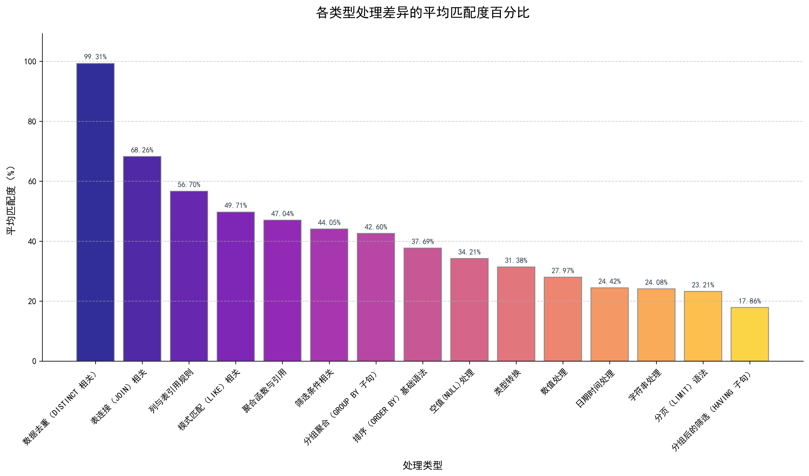

# bird-mini-dev的自然语言问题以及sql方言之间的对应关系

## 更新时间:2025-8-5

我们针对bird-mini-dev数据集的500个自然语言问题在不同数据库上对应的sql语句进行了分析，找出了可能产生方言的自然语言问题及引起方言问题的部分，进一步地，我们对这500个问题中的不同方言问题的出现频率进行了统计，详细的内容介绍，可在下面的文件介绍处找到。

## 1.数据集文件下载

ℹ️ **注意**：这里给出BIRD-mini-dev的官网地址:[https://github.com/bird-bench/mini_dev]

### 对于新用户

如果您是 BIRD Mini-Dev 的新手，您可以使用以下链接下载完整的数据库和数据集：
[https://drive.google.com/file/d/13VLWIwpw5E3d5DUKMvzw7hvHE67a4XkG/view]

### 对于现有用户

如果您已经下载了 BIRD 数据库，您可以使用以下脚本通过 Hugging Face 提取最新的数据更新：

```python
from datasets import load_dataset

# Load the dataset
dataset = load_dataset("birdsql/bird_mini_dev")

# Access the SQLite version
print(dataset["mini_dev_sqlite"][0])

# Access the MySQL version
print(dataset["mini_dev_mysql"][0])

# Access the PostgreSQL version
print(dataset["mini_dev_pg"][0])
```

## 2.MySQL和PostgreSQL数据库下载

- 按照以下说明在 MySQL 和 PostgreSQL 中设置数据库：mini_dev_mysql.jsonmini_dev_postgresql.json

### MySQL

1. 从官方网站下载并安装 MySQL：[https://dev.mysql.com/downloads/mysql/]
2. 设置环境变量：

   ```bash
   export PATH=$PATH:/usr/local/mysql/bin
   ```

3. 启动 MySQL 服务器:

    ```bash
    net start mysql
    ```

4. 登录MySQL服务器并创建数据库（密码将是您在安装过程中设置的密码）

    ```bash
    mysql -u root -p
    CREATE DATABASE BIRD;
    ```

5. 通过运行以下命令构建数据库（您可以在文件夹中找到 MySQL 版本数据库： ）：BIRD_dev.sqlMINIDEV_mysql

    ```bash
    mysql -u root -p BIRD < BIRD_dev.sql
    ```

ℹ️ **注意** : 具体内容可从[https://github.com/bird-bench/mini_dev/blob/main/README.md]

### PostgreSQL

1. 从官网下载并安装postgresql：[https://www.postgresql.org/download/]
2. 从官网下载pgAdmin4：[https://www.pgadmin.org/download/]
3. 在 pgADmin4/terminal 中创建一个名为BIRD
4. 通过运行以下命令构建数据库（您可以在文件夹中找到 PostgreSQL 版本数据库： ）：BIRD_dev.sqlMINIDEV_postgresql

    ```bash
    psql -U USERNAME -d BIRD -f BIRD_dev.sql
    ```

## 3.文件介绍

本文件中主要是对与bird--mini-dev中的数据集在不同的数据库(mysql,pgsql,sqlite)上进行对比，找出自然语言问题和相关方言之间的关系

### 3.1.初始Q/A对

你可以下面这3个文件中  
 "MINIDEV\mysql\initial_code\mysql1.json",  
 "MINIDEV\pg\initial_code\pg.json",  
 "MINIDEV\sqlite\initial_code\sqlite.json"分别找到对于同一个自然语言问题对应的不同关系数据库的sql语句(mysql,sqlite,postgres)

下面以mysql1.json为例，其余两个均类似。

该文件中包含以下信息：

- "db_id":数据库的名称
- "question":根据数据库描述、数据库内容，由人工整理的问题
- "SQL"：表示对应数据库的SQL语句，参考数据库描述、数据库内容，准确回答问题。

    ```json
    [
    {
        "db_id": "debit_card_specializing",
        "question": "What is the ratio of customers who pay in EUR against customers who pay in CZK?",
        "SQL": "SELECT  CAST(SUM(CASE WHEN `Currency` = 'EUR' THEN 1 ELSE 0 END) AS DOUBLE) / SUM(CASE WHEN `Currency` = 'CZK' THEN 1 ELSE 0 END) FROM `customers`"
    }
    ]
    ```

### 3.2.通用sql和方言

- 通用sql

    你可以在下面这3个文件中  
        "MINIDEV\sqlite\sqlite_mysql_result\run_result\do.json",  
        "MINIDEV\sqlite\sqlite_pgsql_result\run_result\do.json",  
        "MINIDEV\pg\pg_mysql_result\run_result\do.json"中分别找到找到mysql，sqlite,pgsql之间的通用sql语句,一共有三组:  
  - mysql和pgsql之间：191个  
  - pgsql和sqlite之间: 356个  
  - mysql和sqlite之间: 219个  
  
    下面的是pgsql和mysql之间的通用sql语句的样例：  

    ```json
    [
    {
        "db_id": "debit_card_specializing",
        "question": "What is the ratio of customers who pay in EUR against customers who pay in CZK?",
        "postgres": "SELECT CAST(SUM(CASE WHEN Currency = 'EUR' THEN 1 ELSE 0 END) AS REAL) / NULLIF(SUM(CASE WHEN Currency = 'CZK' THEN 1 ELSE 0 END), 0) FROM customers",
        "mysql": "SELECT  CAST(SUM(CASE WHEN `Currency` = 'EUR' THEN 1 ELSE 0 END) AS DOUBLE) / SUM(CASE WHEN `Currency` = 'CZK' THEN 1 ELSE 0 END) FROM `customers`"
    }
    ]
    ```

- 方言(以pgsql和mysql为例)

    你可以在"MINIDEV\pg\pg_mysql_result\run_result\undo.json"中找到mysql和pgsql不通用的sql语句，样式如下。

    ```json
    [
    {
        "db_id": "debit_card_specializing",
        "question": "In 2012, who had the least consumption in LAM?",
        "postgres": "SELECT T1.CustomerID FROM customers AS T1 INNER JOIN yearmonth AS T2 ON T1.CustomerID = T2.CustomerID WHERE T1.Segment = 'LAM' AND SUBSTR(T2.Date, 1, 4) = '2012' GROUP BY T1.CustomerID ORDER BY SUM(T2.Consumption) ASC NULLS FIRST LIMIT 1",
        "mysql": "SELECT\n  `T1`.`CustomerID`\nFROM `customers` AS `T1`\nINNER JOIN `yearmonth` AS `T2`\n  ON `T1`.`CustomerID` = `T2`.`CustomerID`\nWHERE\n  `T1`.`Segment` = 'LAM' AND SUBSTR(`T2`.`Date`, 1, 4) = '2012'\nGROUP BY\n  `T1`.`CustomerID`\nORDER BY\n  SUM(`T2`.`Consumption`) ASC\nLIMIT 1"
    }
    ]
    ```

ℹ️ **注意** :方言一共有三组:  

- mysql和pgsql之间：309个  
- pgsql和sqlite之间: 144个  
- mysql和sqlite之间: 281个

### 3.3.方言和自然语言之间的对应关系(以mysql和pgsql之间为例)  

你可以在"MINIDEV\pg\pg_mysql_result\conclude\postgres_mysql_difference.json"中找到可能引起方言问题的所有自然语言问题，以及引起该问题的具体字段,产生的原因，和对应于mysql,pgsql的哪一部分，案例如下。

```json
    [
      {
    "question": "Which are the top ten withdrawals (non-credit card) by district names for the month of January 1996?",
    "postgres_sql": "SELECT DISTINCT T1.A2 FROM district AS T1 INNER JOIN account AS T2 ON T1.district_id = T2.district_id INNER JOIN trans AS T3 ON T2.account_id = T3.account_id WHERE T3.type = 'VYDAJ' AND CAST(T3.date AS TEXT) LIKE '1996-01%' ORDER BY T1.A2 ASC LIMIT 10",
    "mysql_sql": "SELECT DISTINCT\n  `T1`.`A2`\nFROM `district` AS `T1`\nINNER JOIN `account` AS `T2`\n  ON `T1`.`district_id` = `T2`.`district_id`\nINNER JOIN `trans` AS `T3`\n  ON `T2`.`account_id` = `T3`.`account_id`\nWHERE\n  `T3`.`type` = 'VYDAJ' AND `T3`.`date` LIKE '1996-01%'\nORDER BY\n  `A2` ASC\nLIMIT 10",
    "syntax_differences": [
      {
        "difference": "日期处理",
        "detail": "PostgreSQL需要显式将日期转换为文本进行LIKE匹配，MySQL可以直接对日期字段使用LIKE",
        "question_causing_substring": "for the month of January 1996",
        "postgres_differing_substring": "CAST(T3.date AS TEXT) LIKE '1996-01%'",
        "mysql_differing_substring": "`T3`.`date` LIKE '1996-01%'"
      },
      {
        "difference": "标识符引用",
        "detail": "PostgreSQL使用无引号标识符，MySQL使用反引号引用标识符",
        "question_causing_substring": "by district names",
        "postgres_differing_substring": "T1.A2",
        "mysql_differing_substring": "`T1`.`A2`"
      },
      {
        "difference": "ORDER BY引用",
        "detail": "PostgreSQL使用完全限定列名，MySQL可以使用非限定列名",
        "question_causing_substring": "by district names",
        "postgres_differing_substring": "ORDER BY T1.A2 ASC",
        "mysql_differing_substring": "ORDER BY `A2` ASC"
      }
    ],
    "causing_part": "日期处理方式、标识符引用语法和ORDER BY列引用规则的差异"
  }
    ]
```

### 3.4.归类

- 在"MINIDEV\pg\pg_mysql_result\conclude\pg_mysql_conclusion.json"中，我们对所有的方言问题进行了分类并进行了统计，然后计算了每一类中的所有问题的方言对应的自然语言问题部分占总体的比例，输出在了"substring_percentage"字段，一个简单的例子如下:

    ```json
    {       "分页（LIMIT）语法": [
        {
            "question": "List down at least five superpowers of male superheroes.",
            "postgres_sql": "SELECT T3.power_name FROM superhero AS T1 INNER JOIN hero_power AS T2 ON T1.id = T2.hero_id INNER JOIN superpower AS T3 ON T3.id = T2.power_id INNER JOIN gender AS T4 ON T4.id = T1.gender_id WHERE T4.gender = 'Male' LIMIT 5",
            "mysql_sql": "SELECT\n  `T3`.`power_name`\nFROM `superhero` AS `T1`\nINNER JOIN `hero_power` AS `T2`\n  ON `T1`.`id` = `T2`.`hero_id`\nINNER JOIN `superpower` AS `T3`\n  ON `T3`.`id` = `T2`.`power_id`\nINNER JOIN `gender` AS `T4`\n  ON `T4`.`id` = `T1`.`gender_id`\nWHERE\n  `T4`.`gender` = 'Male'\nLIMIT 5",
            "question_causing_substring": "at least five",
            "postgres_differing_substring": "LIMIT 5",
            "mysql_differing_substring": "LIMIT 5",
            "difference": "分页（LIMIT）语法",
            "detail": "PostgreSQL和MySQL的LIMIT语法相同，但位置不同（PostgreSQL在一行，MySQL换行）",
            "substring_percentage": "23.21%"
        }
    ]
    }
    ```  

### 3.5.计算平均值

- 在"MINIDEV\pg\pg_mysql_result\conclude\radio.json"中，我们对每一类的方言问题中包含的所有问题的 "substring_percentage"计算了平均值。

### 3.6.绘图

- 我们针对"MINIDEV\pg\pg_mysql_result\conclude\radio.json"中的所有平均值进行了绘图，绘制的结果如下：  

