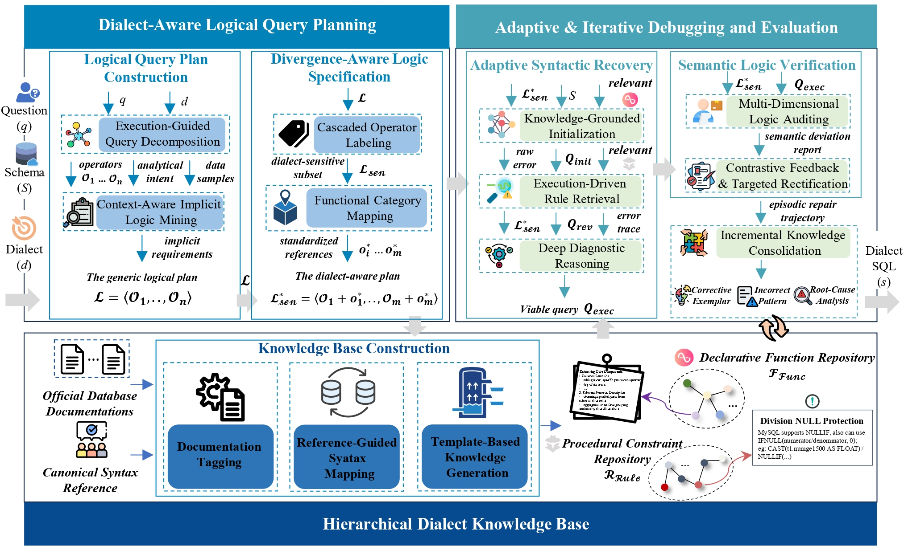

# Dial: A Knowledge-Grounded Dialect-Specific NL2SQL System

This repository contains the implementation for a multi-dialect natural language to SQL (NL2SQL) pipeline and evaluation framework. It supports generating dialect-agnostic logical query plans (LQP), tagging dialect-sensitive operators, RAG-based retrieval of dialect knowledge, and translation to SQL for multiple engines (MySQL, PostgreSQL, SQL Server, DuckDB, Oracle). The evaluation module runs generated SQL on target databases, scores accuracy and executability, and computes Dialect Feature Coverage (DFC).

The following sections detail the structure of the codebase, setup instructions, and how to run the pipeline, dataset migration, and evaluation.

## Overview



The project is organized into three main workflows:

1. **Dial pipeline** (`Dial/`): End-to-end NL → (optional) Schema linking → LQP → dialect-aware tagging → RAG retrieval → SQL translation with execution and semantic verification. It produces per-dialect SQL from natural language questions and schema. **Schema linking (Step 0)** is an optional component and falls outside our primary research scope, which centers on the intricacies of dialect-specific NL2SQL translation. The bundled **DS-NL2SQL** dataset already provides `true_tables_columns`; for other data without this field, you may run Step 0 to infer relevant tables/columns via LLM.
2. **Dataset migration** (`dataset/`): Migrates SQLite databases (e.g. from `duckdb_sqlite_databases`) to MySQL, PostgreSQL, SQL Server, and DuckDB so that the same schema and data are available on multiple engines for evaluation. The **duckdb_sqlite_databases** package is hosted on Hugging Face (see [Data Preparation](#data-preparation)) because it is too large for GitHub.
3. **Evaluation** (`evaluation/`): Executes generated SQL on target engines, compares results to gold answers, and computes accuracy, executability, and DFC; outputs per-task per-engine metrics and an Excel summary.
4. **Knowledge Process** (`knowledge_process/`): Converts official documentation from **any** dialect (DuckDB, PostgreSQL, Oracle, etc.) into the dialect knowledge format used by Dial. Extracts from Git repos or local doc directories, then uses vector retrieval + LLM to produce Functional and Rule-based dialect knowledge files for RAG.

The main entry points are unified at the repository root: `run_dial_pipeline.py`, `run_migration.py`, and `run_evaluation.py`. Knowledge conversion is run via `python knowledge_process/knowledge_create.py`, `tide_functional_knowledge.py`, and `tide_rule.py`.

## Directory Structure

```
.
├── conf/                    # (optional; Dial uses Dial/conf)
├── dataset/
│   ├── config.py            # Data sources, DB credentials, migration targets
│   ├── db_manager.py        # SQLite → MySQL/Postgres/SQL Server/DuckDB migration
│   ├── run_migration.py     # Migration entry (also runnable via root run_migration.py)
│   ├── DS-NL2SQL.json       # Example benchmark JSON
│   └── README.md            # Dataset migration usage
├── evaluation/
│   ├── config.py            # DB config, pipeline tasks, gold result path
│   ├── common_utils.py      # Logging, JSON I/O, custom encoder
│   ├── step1_executor.py    # Per-engine SQL execution (MySQL, PG, SQLite, DuckDB, SQL Server, Oracle)
│   ├── step2_evaluator.py   # Accuracy scoring (0/1/2)
│   ├── step3_dfc.py         # DFC (Dialect Feature Coverage) per item
│   ├── rules.py             # Dialect classification rules for DFC
│   ├── run_pipeline.py      # Execute → Evaluate → DFC → Excel (also via root run_evaluation.py)
│   └── README.md            # Evaluation usage
├── Dial/
│   ├── conf/
│   │   └── settings.py      # Paths, DB config, LLM API, pipeline stages
│   ├── src/
│   │   ├── nl_lqp/          # NL-LQP generation and dialect-aware tagging
│   │   ├── knowledge/       # RAG retriever and runner (HINT-KB)
│   │   ├── schema_linking/   # Step 0: optional schema linking when true_tables_columns missing
│   │   ├── schema/          # DDL fetcher
│   │   └── translation/     # rag2sql, execution check, semantic validation
│   ├── run_dial_pipeline.py # Step 0–4 launcher (also via root run_dial_pipeline.py)
│   └── README.md            # Dial pipeline usage
├── knowledge_process/
│   ├── knowledge_create.py       # Extract docs from Git/local into @dialect2sql@ blocks
│   ├── tide_functional_knowledge.py  # Match template + source → Functional dialect
│   ├── tide_rule.py              # Three-phase: Functional + Rule + Residual → Rule/Functional
│   └── README.md                 # Knowledge conversion usage
├── run_dial_pipeline.py     # Root launcher for Dial pipeline
├── run_migration.py         # Root launcher for dataset migration
├── run_evaluation.py        # Root launcher for evaluation pipeline
└── README.md                # This file
```

## Setup

### Dependencies

- This project requires Python 3.10+. You can set up the environment using `pip` to install the dependencies:
```bash
pip install -r requirements.txt
```

- For **Dial pipeline**: async HTTP, LLM API client, SQLAlchemy, DB drivers (pymysql, psycopg2, pyodbc, oracledb, duckdb, etc.), sqlglot (optional)
- For **dataset migration**: pandas, sqlalchemy, pymysql, psycopg2, pyodbc, duckdb, sqlite3
- For **evaluation**: pandas, numpy, openpyxl (Excel), tqdm, same DB drivers as above

Install DB and driver packages as needed for your target engines (MySQL, PostgreSQL, SQL Server, Oracle, DuckDB, SQLite).

### Data Preparation

1. **Dial pipeline**: Place input JSON (e.g. `filtered_Dialects.json` or the bundled `dataset/DS-NL2SQL.json`) and schema/DB paths as specified in `Dial/conf/settings.py`. Set `BASE_DATA_DIR`, `SQLITE_DB_DIR`, `DUCKDB_DIR`, and pipeline input/output paths (or use environment variables). The repo includes **DS-NL2SQL.json** with `true_tables_columns`; in that case **Schema linking (Step 0) is skipped**. For your own data without `true_tables_columns`, you can optionally run Step 0 (see [Schema linking (Step 0)](#schema-linking-step-0)).
2. **Dataset migration**: The **duckdb_sqlite_databases** (SQLite + DuckDB databases) are too large to host on GitHub. Download from Hugging Face: **[duckdb_sqlite_databases](https://huggingface.co/datasets/zhangxiang666/DS-NL2SQL)** (link to be updated; replace `YOUR_ORG` with the actual repo). After download, extract and set `SQLITE_BASE_DIR` (or per-source `sqlite_db_dir`) in `dataset/config.py`. Configure `DB_CONFIG` for MySQL, Postgres, SQL Server.
3. **Evaluation**: Set `GOLD_RESULT_FILE`, `PIPELINE_TASKS` (input_sql / output_exec paths), and `EXECUTE_ENGINES` in `evaluation/config.py`. Ensure gold result JSON and generated SQL files exist.

## Configuration

- **Dial pipeline**: All paths and API/DB settings are in `Dial/conf/settings.py`. Use `DIAL_*` environment variables to override.
- **Dataset migration**: `dataset/config.py` defines `DATA_SOURCES`, `MIGRATION_TARGETS`, `DB_CONFIG`, `DUCKDB_STORAGE_PATH`, `REUSE_EXISTING_DB`, etc.
- **Evaluation**: `evaluation/config.py` defines `DB_CONFIG`, `EXECUTE_ENGINES`, `PIPELINE_TASKS`, `GOLD_RESULT_FILE`, `FINAL_EXCEL_PATH`.
- **Knowledge Process**: Use environment variables (`KNOWLEDGE_*`, `TIDE_*`, `OPENAI_*`) or edit CONFIG in each script. See `knowledge_process/README.md`.

## Usage

All three workflows can be started from the repository root.

### Run Dial pipeline (NL → LQP → RAG → SQL)

From the project root:

```bash
python run_dial_pipeline.py --steps 0,1,2,3,4
```

To skip **Schema linking** (recommended when your input already has `true_tables_columns`, e.g. DS-NL2SQL):

```bash
python run_dial_pipeline.py --steps 1,2,3,4
```

Or run specific steps:

```bash
python run_dial_pipeline.py --step0
python run_dial_pipeline.py --step1 --step2
python run_dial_pipeline.py --step3 --step4
```

**Steps**: 0 = Schema linking (optional), 1 = Generate NL-LQP, 2 = Tag dialect-aware LQP, 3 = RAG retrieval, 4 = Translation and feedback iteration. Configure paths and API in `Dial/conf/settings.py`.

#### Schema linking (Step 0)

- **When it runs**: Only for input items that **do not** have a non-empty `true_tables_columns` field. If every item has it, Step 0 just copies the input to the schema-linking output and exits.
- **When to skip**: Schema linking is **not the focus of this project**. The bundled **DS-NL2SQL** dataset already includes `true_tables_columns`, so for standard use you can run `--steps 1,2,3,4` and skip Step 0.
- **When to use**: For your own datasets or benchmarks that lack ground-truth table/column annotations, you can run Step 0 so that the pipeline infers relevant `Table.Column` from the question and full DB schema via an LLM; the result is then used as `true_tables_columns` in downstream steps.

### Run dataset migration (SQLite → multi-engine)

From the project root:

```bash
python run_migration.py
```

Configure `SQLITE_BASE_DIR` and `DB_CONFIG` in `dataset/config.py` (or via environment variables). See `dataset/README.md` for details.

### Run evaluation (Execute → Evaluate → DFC)

From the project root:

```bash
python run_evaluation.py
```

This runs Step1 (execute SQL per engine), Step2 (accuracy evaluation), Step3 (DFC), and writes the summary Excel. Configure tasks and gold file in `evaluation/config.py`. See `evaluation/README.md` for details.

### Knowledge Process (Dialect Knowledge Base Conversion)

Build dialect knowledge from official docs (DuckDB, PostgreSQL, Oracle, etc.):

1. **Extract docs**: `python knowledge_process/knowledge_create.py` — config `TARGET_DIALECT`, `SOURCE_TYPE` (git/local), paths.
2. **Functional conversion**: `python knowledge_process/tide_functional_knowledge.py` — config `TEMPLATE_DIALECT`, `SOURCE_DIALECT`, paths.
3. **Rule + Functional conversion**: `python knowledge_process/tide_rule.py` — three-phase LLM conversion.

Output files are placed in `Dial/src/knowledge/knowledge/Functional_dialect/` and `Rule_based_dialect/` for RAG. See `knowledge_process/README.md` for full configuration.

### Alternative entry points

- Dial pipeline from `Dial` folder: `cd Dial` then `python run_dial_pipeline.py`
- Migration from dataset package: `python -m dataset.run_migration`
- Evaluation from evaluation package: `python -m evaluation.run_pipeline`

## Key Code Components

- **`run_dial_pipeline.py` (root)**: Adds `Dial/` to `sys.path`, changes working directory to `Dial/`, and invokes `Dial/run_dial_pipeline.main()` so that steps 0–4 run with correct paths and imports.
- **`run_migration.py` (root)**: Adds project root to `sys.path` and calls `dataset.run_migration.main()` to discover DBs, find SQLite paths, and run `DBManager.setup_and_migrate()` for each.
- **`run_evaluation.py` (root)**: Adds project root to `sys.path` and calls `evaluation.run_pipeline.main()` to run the Execute → Evaluate → DFC pipeline and generate the Excel report.
- **`Dial/run_dial_pipeline.py`**: Parses `--steps` / `--step0` … `--step4`, and runs the corresponding modules (`schema_linking.main_async`, `generate_nl_lqp`, `tag_dialect_aware_lqp`, `runner`, `translation.main`). Step 0 (schema linking) is optional and skipped when input already has `true_tables_columns` (e.g. DS-NL2SQL).
- **`dataset/db_manager.py`**: Creates MySQL/Postgres/SQL Server databases and DuckDB files from SQLite; supports smart migration (essential rows) and reuse of existing DBs.
- **`evaluation/run_pipeline.py`**: Loads gold results and task configs; for each task and engine runs `step1_executor.run_execution`, `step2_evaluator.get_evaluation_scores`, and `step3_dfc.calculate_dfc_entry`; aggregates and writes Excel.
- **`knowledge_process/knowledge_create.py`**: Extracts official docs (Git or local) for any dialect into `@dialect2sql@` blocks.
- **`knowledge_process/tide_functional_knowledge.py`**: Matches template dialect templates with source dialect chunks via vector retrieval; LLM merges into Functional dialect knowledge.
- **`knowledge_process/tide_rule.py`**: Three-phase (Functional + Rule-based + Residual) conversion from source docs to Rule + Functional dialect knowledge.

For more detail, see the README in each subfolder: `dataset/README.md`, `evaluation/README.md`, `knowledge_process/README.md`, and `Dial/README.md`.
